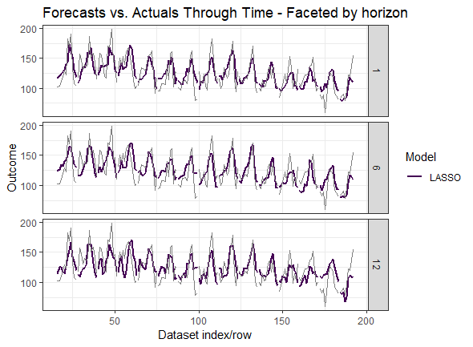
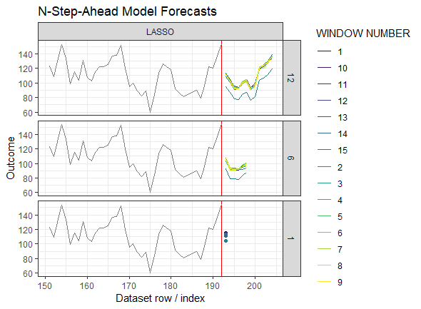

[](https://www.tidyverse.org/lifecycle/#experimental)

# package::forecastML 

The purpose of `forecastML` is to provide a series of functions and visualizations that simplify the process of 
multi-step-ahead direct forecasting with standard machine learning algorithms. It's aimed at 
helping the user quickly assess the (a) accuracy, (b) stability, and (c) generalizability of single-outcome forecasts 
produced from potentially high-dimensional modeling datasets.

This package is inspired by Bergmeir, Hyndman, and Koo's 2018 paper 
[A note on the validity of cross-validation for evaluating autoregressive time series prediction](https://robjhyndman.com/papers/cv-wp.pdf). 
In particular, `forecastML` makes use of 

* **lagged predictors** and 
* **nested cross-validation** with (a) user-specified standard cross-validation in the inner loop and (b) block-contiguous validation 
datasets in the outer loop

to build and evaluate high-dimensional forecast models **without having to use methods that are time-series specific**. 

The following quote from Bergmeir et al.'s article nicely sums up the aim of this package:

> "When purely (non-linear, nonparametric) autoregressive methods are applied to forecasting problems, as is often the case
> (e.g., when using Machine Learning methods), the aforementioned problems of CV are largely
> irrelevant, and CV can and should be used without modification, as in the independent case."

## Install

``` r
devtools::install_github("nredell/forecastML")
library(forecastML)
```
## Walkthrough

Detailed **[forecastML overview vignette](https://nredell.github.io/data_science_blog/forecastML/)**.

## Example

``` r
# Sampled Seatbelts data from the R package datasets.
data("data_seatbelts", package = "forecastML")

# Example - Training data for 12 horizon-specific models w/ common lags per predictor.
horizons <- 1:12
lookback <- 1:15

#------------------------------------------------------------------------------
# Create a dataset of lagged predictors for modeling.
data_train <- forecastML::create_lagged_df(data_seatbelts, type = "train", 
                                           outcome_cols = 1, lookback = lookback, 
                                           horizon = horizons)

#------------------------------------------------------------------------------
# Create validation datasets for outer-loop nested cross-validation.
windows <- forecastML::create_windows(data_train, window_length = 12)

#------------------------------------------------------------------------------
# User-define model - LASSO
# The model takes in a data.frame with a target and predictors with exactly the same format as
# in create_lagged_df(). 'outcome_cols' is the column index of the target. The
# model returns a model object suitable for a predict-type function.
library(glmnet)
model_function <- function(data, outcome_cols = 1) {

  x <- data[, -(outcome_cols), drop = FALSE]
  y <- data[, outcome_cols, drop = FALSE]
  x <- as.matrix(x, ncol = ncol(x))
  y <- as.matrix(y, ncol = ncol(y))

  model <- glmnet::cv.glmnet(x, y)
  return(model)
}

#------------------------------------------------------------------------------
# Train a model across forecast horizons and validation datasets.
model_results <- forecastML::train_model(data_train, windows,
                                         model_function, model_name = "LASSO")
                                         
#------------------------------------------------------------------------------
# User-defined prediction function - LASSO
# The predict() wrapper takes two positional arguments. First,
# the returned model from the user-defined modeling function (model_function() above).
# Second, a data.frame of predictors--lagged predictors will be created automatically
# using create_lagged_df().
prediction_function <- function(model, data_features) {

  x <- as.matrix(data_features, ncol = ncol(data_features))

  data_pred <- data.frame("y_pred" = predict(model, x, s = "lambda.min"))
  return(data_pred)
}

# Predict on the validation datasets.
data_valid <- predict(model_results, prediction_function = list(prediction_function))

#------------------------------------------------------------------------------
# Plot forecasts for each validation dataset.
plot(data_valid, horizons = c(1, 6, 12))

#------------------------------------------------------------------------------
# Forecast.
data_forecast <- forecastML::create_lagged_df(data_seatbelts, type = "forecast", 
                                              outcome_cols = 1,
                                              lookback = lookback, horizons = horizons)
                                              
data_forecasts <- predict(model_results, prediction_function = list(prediction_function),
                          data_forecast = data_forecast)
                          
plot(data_forecasts, data[-(1:150), ], horizons = c(1, 6, 12))
```




