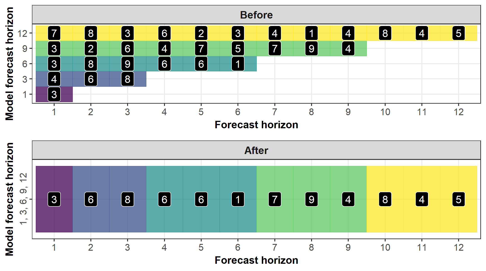
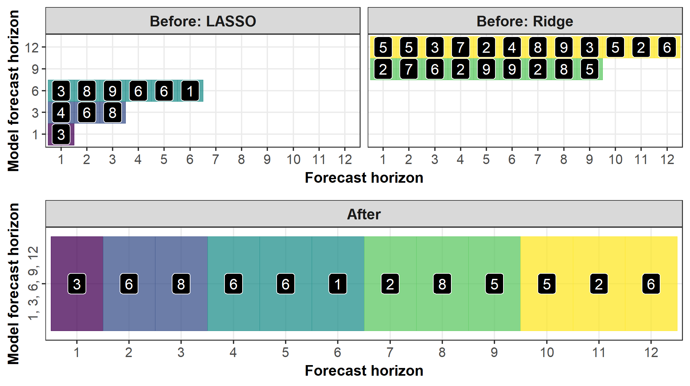
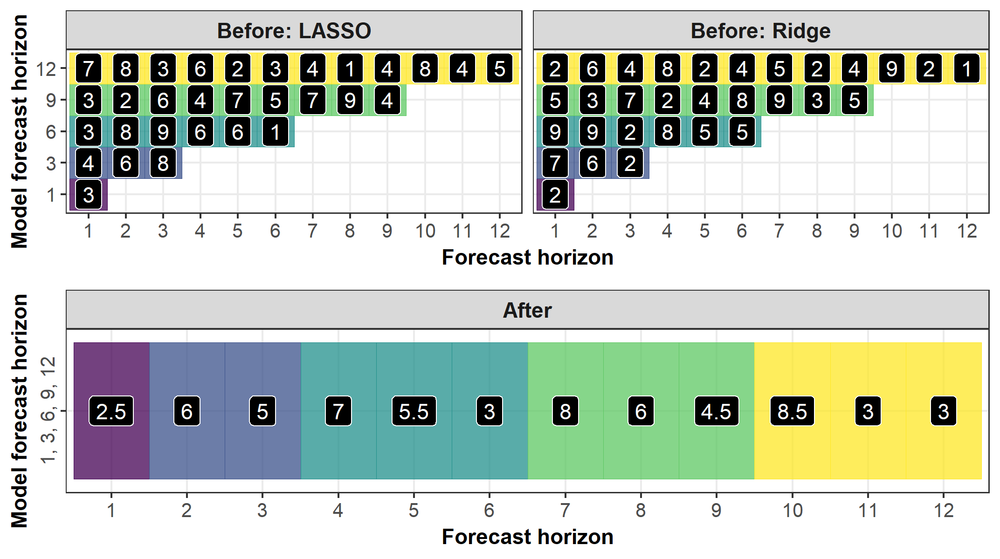

```{r, include = FALSE}
knitr::opts_chunk$set(fig.width = 7.15, fig.height = 4)
knitr::opts_knit$set(fig.width = 7.15, fig.height = 4)
```

# **Purpose**

The purpose of this vignette is to illustrate the various approaches in `forecsatML` for producing 
final forecasts that are (a) a combination of short- and long-term forecasts as well 
as (b) a combination of many ML models at select forecast horizons.

The goal of `forecastML::combine_forecasts()` is to provide maximum flexibility when producing 
a single forecast that is expected to perform as well in the near-term as it is in the long-term.

# **Forecast Combination by Horizon**

* Forecast combinations with `forecastML::combine_forecasts(..., type = "horizon")` are a simple and 
effective method for producing final forecasts that consist of (a) an ensemble of short- and long-term 
forecasts and (b) an ensemble of separately trained ML models at any forecast horizon.

* Below are 3 examples:
    + 1: An ensemble of short- and long-term forecasts
    + 2: An ensemble of short- and long-term forecasts with separately trained ML models
    + 3: An ensemble of short- and long-term forecasts with a cross-sectional ensemble of models at select horizons

## **Load Packages & Data**

```{r, warning = FALSE, message = FALSE}
library(forecastML)
library(dplyr)
library(ggplot2)
library(glmnet)

data("data_seatbelts", package = "forecastML")
data <- data_seatbelts
```

## **1: One Model Training Function**

* **Setup:**
    + 1 model training function (could consist of an ensemble of models).
    + Multiple direct forecast horizons.
<p>
* **Combination:**
    + Greedy: Models with shorter direct forecast horizons produce near-term forecasts, and 
    models with longer direct forecast horizons only produce forecasts at horizons above and beyond 
    those from the short-term models.
<p>
* **Pros:**
    + Easy to implement.
<p>
* **Cons:**
    + If the model training function uses 1 ML algorithm--e.g., a neural network--to build both short- and long-term direct forecast models--which will have different parameters/hyperparameters--, 
    it could be the case that entirely different model classes--e.g., support vector machines--may produce 
    better short- or long-term final forecasts if included in the forecast combination.
<p>

{width=715px, height=400px}

<br>

* **Example:**

```{r}
horizons <- c(1, 3, 6, 9, 12)
data_train <- forecastML::create_lagged_df(data_seatbelts, type = "train", method = "direct",
                                           outcome_col = 1, lookback = 1:15, horizon = horizons)

windows <- forecastML::create_windows(data_train, window_length = 0)

model_fun <- function(data) {
  x <- as.matrix(data[, -1, drop = FALSE])
  y <- as.matrix(data[, 1, drop = FALSE])
  set.seed(1)
  model <- glmnet::cv.glmnet(x, y, nfolds = 5)
}

model_results <- forecastML::train_model(data_train, windows, model_name = "LASSO", model_function = model_fun)

prediction_fun <- function(model, data_features) {
  data_pred <- data.frame("y_pred" = predict(model, as.matrix(data_features)),
                          "y_pred_lower" = predict(model, as.matrix(data_features)) - 30,
                          "y_pred_upper" = predict(model, as.matrix(data_features)) + 30)
}

data_forecast <- forecastML::create_lagged_df(data_seatbelts, type = "forecast", method = "direct",
                                              outcome_col = 1, lookback = 1:15, horizon = horizons)

data_forecasts <- predict(model_results, prediction_function = list(prediction_fun), data = data_forecast)

data_forecasts <- forecastML::combine_forecasts(data_forecasts, type = "horizon")

plot(data_forecasts, data_actual = data_seatbelts[-(1:170), ], actual_indices = (1:nrow(data_seatbelts))[-(1:170)])
```

***

## **2: Multiple Model Training Functions**

* **Setup:**
    + 2 or more model training functions.
    + Multiple direct forecast horizons.
<p>
* **Combination:**
    + Greedy: Models with shorter direct forecast horizons produce near-term forecasts, and 
    models with longer direct forecast horizons only produce forecasts at horizons above and beyond 
    those from the short-term models.
    + If multiple model training functions produce models with the same direct forecast horizon, 
    forecasts for the shared horizon(s) are combined with the function passed in `combine_forecasts(..., agregate = function)` 
    (see example 3 below).
<p>
* **Pros:**
    + Gives precise control over the algorithms used to produce short- and long-term forecasts. For example, a 
    large neural network may produce the best short-term forecasts while a linear model may produce the best 
    long-term forecasts.
    + Also useful with large data when training multiple direct forecast models with one call to `forecastML::train_model()` 
    uses too much memory. Here, you would train one model at a time and combine them with 
    `forecastML::combine_forecasts()`.
<p>
* **Cons:**
    + More code.
<p>

{width=715px, height=400px}

<br>

* **Example:**

```{r}
# LASSO

horizons <- c(1, 3, 6)
data_train <- forecastML::create_lagged_df(data_seatbelts, type = "train", method = "direct",
                                           outcome_col = 1, lookback = 1:15, horizon = horizons)

windows <- forecastML::create_windows(data_train, window_length = 0)

model_fun_lasso <- function(data) {
  x <- as.matrix(data[, -1, drop = FALSE])
  y <- as.matrix(data[, 1, drop = FALSE])
  set.seed(1)
  model <- glmnet::cv.glmnet(x, y, alpha = 1, nfolds = 5)
}

model_results <- forecastML::train_model(data_train, windows, model_name = "LASSO", model_function = model_fun_lasso)

prediction_fun <- function(model, data_features) {
  data_pred <- data.frame("y_pred" = predict(model, as.matrix(data_features)),
                          "y_pred_lower" = predict(model, as.matrix(data_features)) - 30,
                          "y_pred_upper" = predict(model, as.matrix(data_features)) + 30)
}

data_forecast <- forecastML::create_lagged_df(data_seatbelts, type = "forecast", method = "direct",
                                              outcome_col = 1, lookback = 1:15, horizon = horizons)

data_forecasts_lasso <- predict(model_results, prediction_function = list(prediction_fun), data = data_forecast)
#------------------------------------------------------------------------------
# Ridge

horizons <- c(9, 12)
data_train <- forecastML::create_lagged_df(data_seatbelts, type = "train", method = "direct",
                                           outcome_col = 1, lookback = 1:15, horizon = horizons)

windows <- forecastML::create_windows(data_train, window_length = 0)

model_fun_ridge <- function(data) {
  x <- as.matrix(data[, -1, drop = FALSE])
  y <- as.matrix(data[, 1, drop = FALSE])
  set.seed(1)
  model <- glmnet::cv.glmnet(x, y, alpha = 0, nfolds = 5)
}

model_results <- forecastML::train_model(data_train, windows, model_name = "Ridge", model_function = model_fun_ridge)

prediction_fun <- function(model, data_features) {
  data_pred <- data.frame("y_pred" = predict(model, as.matrix(data_features)),
                          "y_pred_lower" = predict(model, as.matrix(data_features)) - 30,
                          "y_pred_upper" = predict(model, as.matrix(data_features)) + 30)
}

data_forecast <- forecastML::create_lagged_df(data_seatbelts, type = "forecast", method = "direct",
                                              outcome_col = 1, lookback = 1:15, horizon = horizons)

data_forecasts_ridge <- predict(model_results, prediction_function = list(prediction_fun), data = data_forecast)
#------------------------------------------------------------------------------
# Forecast combination.

data_forecasts <- forecastML::combine_forecasts(data_forecasts_lasso, data_forecasts_ridge, type = "horizon")

plot(data_forecasts, data_actual = data_seatbelts[-(1:170), ], actual_indices = (1:nrow(data_seatbelts))[-(1:170)])
```

***

## **3: Multiple Model Training Functions - Aggregation**

* **Setup:**
    + 2 or more model training functions.
    + The model training functions share the same direct forecast horizons (complete overlap is not necessary).
    + Multiple direct forecast horizons.
<p>
* **Combination:**
    + If multiple model training functions produce models with the same direct forecast horizon, 
    forecasts for the shared horizon(s) are combined with the function passed in `combine_forecasts(..., agregate = function)`.
    + The default combination for shared horizons is `median()`.
    + Greedy: Models with shorter direct forecast horizons produce near-term forecasts, and 
    models with longer direct forecast horizons only produce forecasts at horizons above and beyond 
    those from the short-term models.
<p>
* **Pros:**
    + A simple way to produce ensemble forecasts at a given forecast horizon.
<p>
* **Cons:**
    + More code.
<p>

{width=715px, height=400px}

<br>

* **Example:**

```{r}
# LASSO

horizons <- c(1, 3, 6, 9, 12)
data_train <- forecastML::create_lagged_df(data_seatbelts, type = "train", method = "direct",
                                           outcome_col = 1, lookback = 1:15, horizon = horizons)

windows <- forecastML::create_windows(data_train, window_length = 0)

model_fun_lasso <- function(data) {
  x <- as.matrix(data[, -1, drop = FALSE])
  y <- as.matrix(data[, 1, drop = FALSE])
  set.seed(1)
  model <- glmnet::cv.glmnet(x, y, alpha = 1, nfolds = 5)
}

model_results <- forecastML::train_model(data_train, windows, model_name = "LASSO", model_function = model_fun_lasso)

prediction_fun <- function(model, data_features) {
  data_pred <- data.frame("y_pred" = predict(model, as.matrix(data_features)),
                          "y_pred_lower" = predict(model, as.matrix(data_features)) - 30,
                          "y_pred_upper" = predict(model, as.matrix(data_features)) + 30)
}

data_forecast <- forecastML::create_lagged_df(data_seatbelts, type = "forecast", method = "direct",
                                              outcome_col = 1, lookback = 1:15, horizon = horizons)

data_forecasts_lasso <- predict(model_results, prediction_function = list(prediction_fun), data = data_forecast)
#------------------------------------------------------------------------------
# Ridge

horizons <- c(1, 3, 6, 9, 12)
data_train <- forecastML::create_lagged_df(data_seatbelts, type = "train", method = "direct",
                                           outcome_col = 1, lookback = 1:15, horizon = horizons)

windows <- forecastML::create_windows(data_train, window_length = 0)

model_fun_ridge <- function(data) {
  x <- as.matrix(data[, -1, drop = FALSE])
  y <- as.matrix(data[, 1, drop = FALSE])
  set.seed(1)
  model <- glmnet::cv.glmnet(x, y, alpha = 0, nfolds = 5)
}

model_results <- forecastML::train_model(data_train, windows, model_name = "Ridge", model_function = model_fun_ridge)

prediction_fun <- function(model, data_features) {
  data_pred <- data.frame("y_pred" = predict(model, as.matrix(data_features)),
                          "y_pred_lower" = predict(model, as.matrix(data_features)) - 30,
                          "y_pred_upper" = predict(model, as.matrix(data_features)) + 30)
}

data_forecast <- forecastML::create_lagged_df(data_seatbelts, type = "forecast", method = "direct",
                                              outcome_col = 1, lookback = 1:15, horizon = horizons)

data_forecasts_ridge <- predict(model_results, prediction_function = list(prediction_fun), data = data_forecast)
#------------------------------------------------------------------------------
# Forecast combination.

data_forecasts <- forecastML::combine_forecasts(data_forecasts_lasso, data_forecasts_ridge,
                                                type = "horizon", aggregate = stats::median)

plot(data_forecasts, data_actual = data_seatbelts[-(1:170), ], actual_indices = (1:nrow(data_seatbelts))[-(1:170)])
```

***
